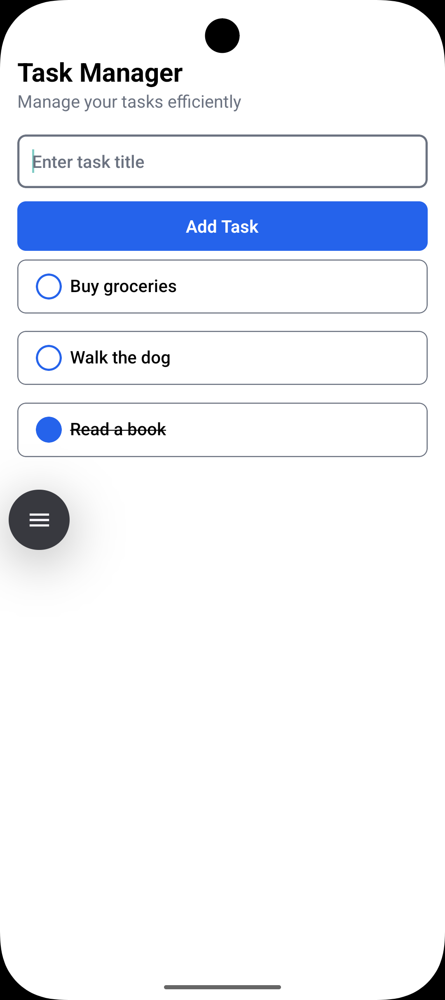

# Todo App

A small React Native todo app built with Redux Toolkit. Tasks are persisted locally using AsyncStorage so they survive app restarts.

## Screenshot



## Features

- Add, toggle complete, and delete tasks
- Filter tasks by All / Pending / Completed
- Tasks are saved locally using AsyncStorage

## Setup

1. Install dependencies

```bash
npm install
# or if you use yarn
yarn
```

2. Install iOS pods (macOS, when running on iOS)

```bash
npx pod-install
# or
cd ios && pod install && cd ..
```

3. Run the app

Android:

```bash
npm run android
```

iOS:

```bash
npm run ios
```

## Notes about AsyncStorage

- The project adds `@react-native-async-storage/async-storage` to persist tasks. After pulling changes, run `npm install` (or `yarn`) and then rebuild the app so the native module is linked.
- If you see a TypeScript error about missing types for AsyncStorage, installing the package will resolve it.

## Project structure (relevant files)

- `src/store/slices/taskSlice.ts` — contains task reducers; now includes `setTasks` to replace tasks from storage.
- `src/store/index.ts` — loads tasks from AsyncStorage on startup and subscribes to save changes.
- `src/screens/HomeScreen.tsx` — UI for adding/filtering tasks.
